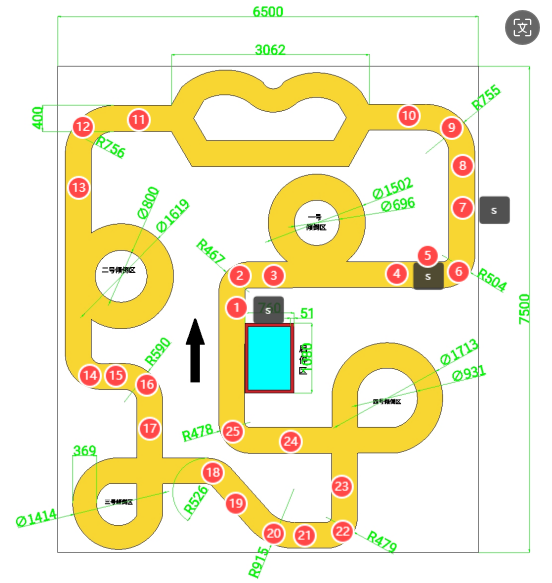

## 2024年睿康物资运输比赛源代码——哈士Go

---

### 环境配置
### 代码使用
1. 准备工作
   1. 机械狗端  
   ```
   cd Robcom
   # 杀相机，ROS相关的进程
   sh kill.sh
   ```
   2. 机械臂端
   ```
   cd XXX
   # 启动机械臂服务器
   python serve.py
   ```
2. 运行程序
```
python Rocom_Race.py
```
3. 其他代码
4. 比赛地图

   